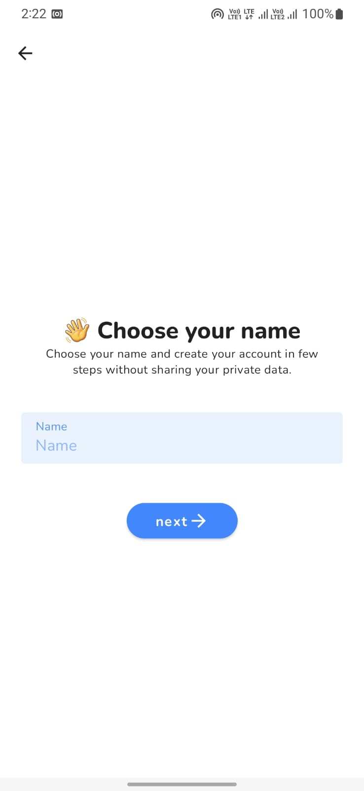

# Primer-Android
💬 Primer is a private, secure and end-to-end communication application.




## Teck Stack
✅ Kotlin Coroutines\
✅ Jetpack Compose\
✅ MVVM & Clean Architecture\
✅ Modularization\
✅ Room Database\
✅ MongoDb Realm\
✅ Caching & Repository Pattern \
✅ Cipher - Encryption and Decryption\
✅ Gradle Plugins & Catalog\
✅ and much more...

## Contribution
We encourage you to participate in this open source project. We love Pull Requests, Bug Reports, ideas, (security) code reviews or any other kind of positive contribution.

### Step 1. Fork & Clone
First, just fork it in your account. Then, run this command in your terminal to clone.\
```groovy
git clone https://github.com/<username>/Primer-Android.git
```


### Step 2. Setup
You need a mongodb account with sync realm app services to build the app successfully. You need to generate few keys from your mongodb project and mention them in your local.properties file.
> local.properties
```groovy
# Mongo Realm Backend
APP_MONGO_REALM_APP_USER_DOMAIN = "user@primer.com"
APP_MONGO_REALM_APP_ID = "..."
APP_MONGO_REALM_AUTH_API = "..."
```

### Step 3. Build
As Primer is built on top of features and flavors. You have to be take care of which build-varient you are using. 

